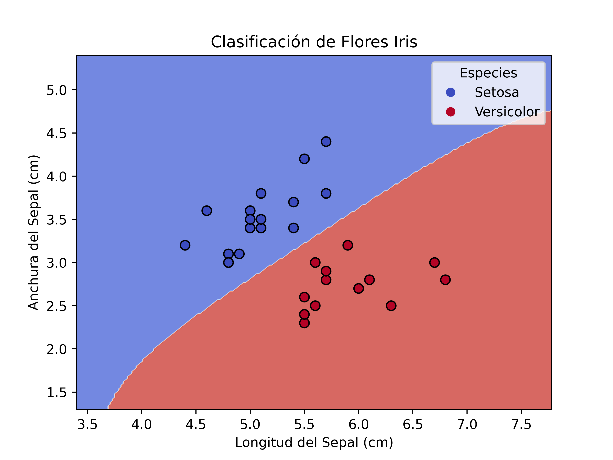

SVM
===
A really simple implementation of the Support Vector Machine (SVM) algorithm, which is an effective tool for solving
classification and regression problems in machine learning.

## Running
To run the program, first install the dependencies:
```bash
pip install -r requirements.txt
```

Then run the main script:
```bash
python main.py
```

## Results
The program will output the accuracy of the model, as well as a scatter plot of the data points and the decision
boundary.



## Dependencies
### Python
- [Python 3.8 or above](https://www.python.org/downloads/)
- Python modules:
  - numpy
  - pandas
  - scikit-learn
  - matplotlib
- I suggest using venv & pip for development & dependency management. (In case of Apple Silicon use conda)

## Notes
This project was written as part of the Masters in Computer Science course "Advanced Topics on Databases" at the
University of the Bío-Bío.
